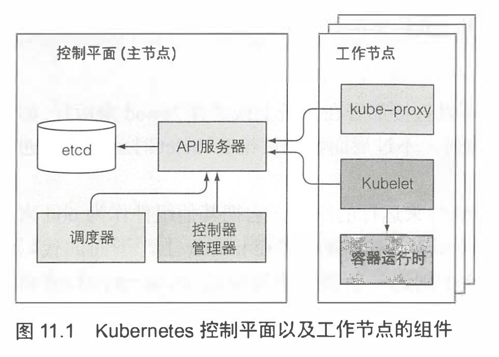
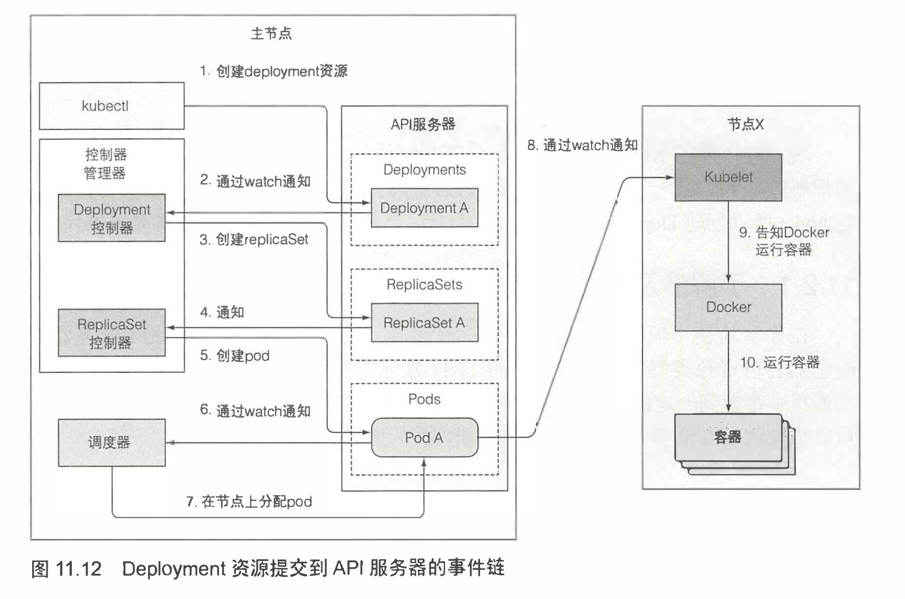
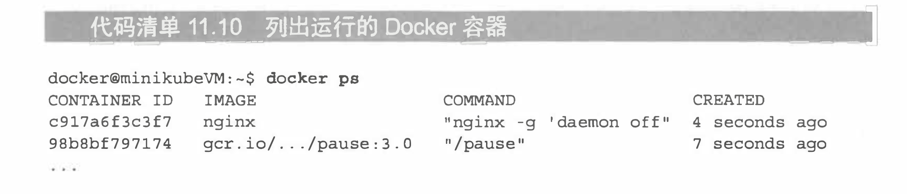
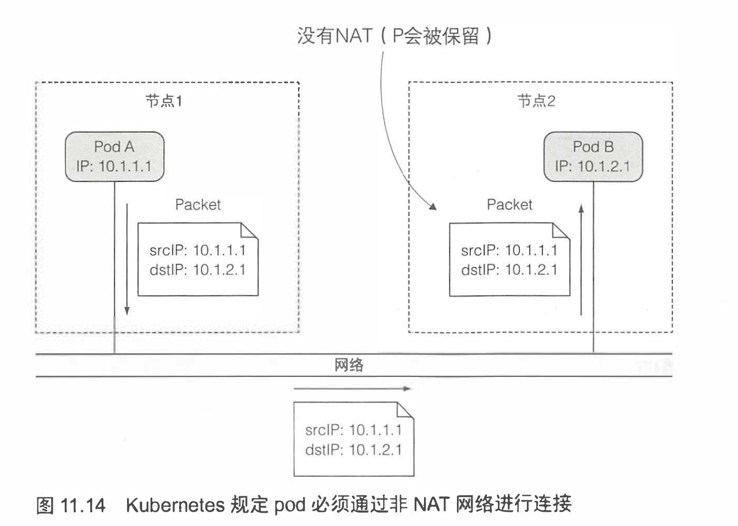
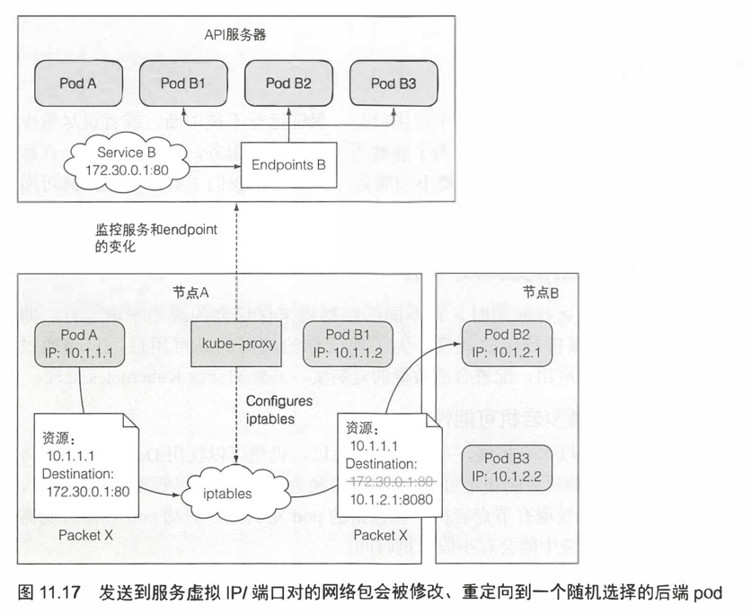

# 架构图
- 

- 控制面板（主节点）
  - etcd
  - api server
    - kubectl get componentstatuses 可查看其他3 种状态 
  - scheduler
  - controller-manager

- 工作节点
  - kube-proxy
  - kubelet
  - 容器

- 除了 kubelet， 其他都是pod 运行
  - kubectl get po -o custom-columns=POD:metadata.name,NODE:spec.nodeName --sort-by spec.nodeName -n kube-system

- etcd
  - k8s 资源如pods namespaces configmaps 等manifest

- api server
  - 认证用户， 授权， 校验资源
  - 创建资源（通过controller-manager 等）， 监听资源
    - kubectl get pod fortune -o yaml --watch
    - kubectl get pods --watch

- scheduler
  - 将pod 调度在工作node 上

- controller-manager
  - 做具体工作部署资源

- kubelet
  - 负责所有运行在工作节点上内容的组件
  - node 资源
  - 接收分配的pod
  - 运行容器

- kube-proxy
  - kube-proxy 确保对服务 IP 和端口的连接最终 能到达支持服务(或者其他，非 pod 服务终端)的某个 pod 处

# 控制器如何协作
- 

# 了解运行中的 pod 是什么
- 
  - pause 为基础容器
  - 一个pod 多个容器均在此基础容器

# 跨pod网络
- 

# 服务是如何实现的
- 
